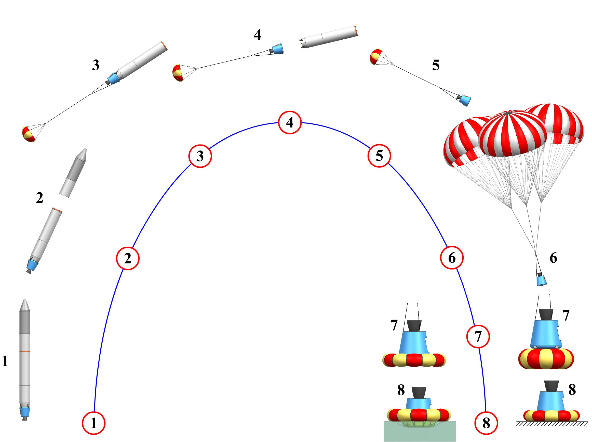
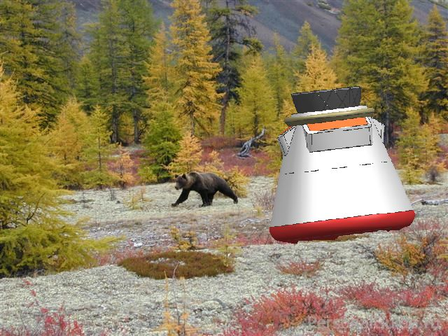

## WEB-САЙТ ПАТЕНТА - RU142981U1 
#### СИСТЕМА СПАСЕНИЯ РАКЕТНЫХ ДВИГАТЕЛЕЙ

Кандидаты техн. наук А.Е. Милов, В.В. Ткач

Предложение относится к области ракетно-космической техники и может найти применение при создании новых или модернизации существующих одноразовых ракетно-космических систем выведения в системы с элементами многократного использования.  Система спасения используется преимущественно для спасения жидкостных ракетных двигателей с целью их повторного или многократного применения в составе первых (полуторных) ступеней ракет.
 

##### Рисунок - 1. Схема применения системы спасения жидкостного ракетного двигателя первой ступени космической ракеты-носителя.

#### Раскрытие

 Задачей, на решение которой направлена предлагаемая система спасения, является снижение стоимости выведения полезного груза за счёт повторного либо многократного использования ракетного двигателя, спасаемого простой, лёгкой и надёжной системой.
 Предлагаемая система спасения ракетного двигателя конструктивно проста, не требует обеспечения полной герметичности, избыточной прочности, не содержит механизмов, специальных средств управления, навигации и маневрирования, предназначена для спасения только двигателя и поэтому имеет минимальный вес. В связи с этим проигрыш в массе выводимого полезного груза, по отношению к одноразовым ракетно-космическим системам, будет минимальным, а значит, стоимость отработки системы спасения и сроки её окупаемости будут малы.
 Кроме того, выработавший свой ресурс, многократно использованный двигатель, при последнем использовании не предусматривает применения системы спасения, поэтому в этом случае потери в массе полезного груза не будет, что повлияет на снижение стоимости его выведения.

##### Рисунок - 2. Ракетный двигатель в капсуле где-то в тайге

На сайте также представлен список и ксерокопии научных статей авторов.
